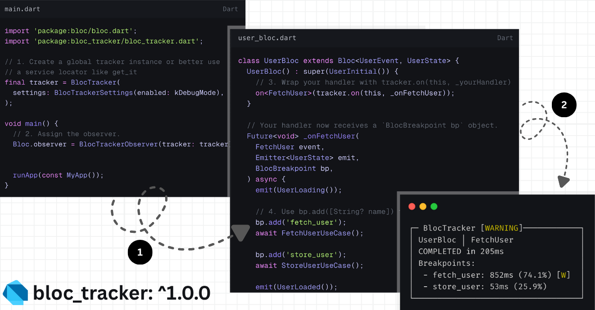

# BlocTracker 🔬

[](https://pub.dev/packages/bloc_tracker)
[](https://opensource.org/licenses/MIT)
[](https://pub.dev/packages/lints)


<p align="center"></p>

**A powerful, zero-dependency performance monitoring and debugging tool for the `bloc` library.**

Move beyond simple `print` statements. BlocTracker gives you pinpoint accuracy on your event handlers, helping you find performance bottlenecks, track down failures, and understand your app's logic flow with precision.

-   **⏱️ Performance Profiling:** Automatically measures the execution time of every event handler.
-   **📌 Breakpoint Tracking:** Add named breakpoints to profile specific sections of your code (e.g., API calls, database queries).
-   **✅ Performance Budgets:** Define `warning` and `severe` time thresholds to automatically flag slow operations.
-   **🐛 Granular Error Reporting:** Pinpoint exactly which breakpoint in your event handler failed.
-   **🌐 Real-time Web UI:** Launch a local web server to monitor your app's BLoC events live in your browser.
-   **🧩 Extensible & Standalone:** No external dependencies. Use the default console logger or plug in your own structured logging service.


## 📚 Table of Contents

-   [🚀 Getting Started](#-getting-started)
    -   [Installation](#1-installation)
    -   [Basic Setup](#2-basic-setup)
    -   [Instrument your BLoC](#3-instrument-your-bloc)
-   [✨ Features](#-features)
    -   [Performance Thresholds](#performance-thresholds)
    -   [Error Reporting](#error-reporting)
    -   [Live Web UI](#-live-web-ui)
-   [🔌 Advanced Usage](#-advanced-usage)
    -   [Custom Trace Handling](#custom-trace-handling)
-   [🤝 Contributing](#-contributing)
-   [🌟 Star History](#-star-history)
-   [✍️ Author](#️-author)
-   [❤️ Support the Project](#️-support-the-project)
-   [📜 License](#-license)

## 🚀 Getting Started

### 1. Installation

Add `bloc_tracker` to your `pubspec.yaml` dependencies:

```bash
flutter pub add bloc_tracker
```

### 2. Basic Setup

In your `main.dart` file, create a `BlocTracker` instance and assign the `BlocTrackerObserver` to `Bloc.observer`.

```dart
// lib/main.dart
import 'package:bloc/bloc.dart';
import 'package:bloc_tracker/bloc_tracker.dart';
import 'package:flutter/foundation.dart';

// 1. Create a global tracker instance.
//    (Disable in release builds for performance)
final tracker = BlocTracker(
  settings: BlocTrackerSettings(enabled: kDebugMode),
);

void main() {
  // 2. Assign the observer.
  Bloc.observer = BlocTrackerObserver(tracker: tracker);

  runApp(const MyApp());
}
```

### 3. Instrument your BLoC

Modify your BLoC to use the tracker. The recommended approach is to wrap your event handlers with `tracker.on()`.

```dart
import 'package:bloc_tracker/bloc_tracker.dart';

class UserBloc extends Bloc<UserEvent, UserState> {
  UserBloc() : super(UserInitial()) {
    // 1. Wrap your handler with tracker.on(this, _yourHandler)
    on<FetchUser>(tracker.on(this, _onFetchUser));
  }

  // 2. Your handler now receives a `BlocBreakpoint bp` object.
  Future<void> _onFetchUser(
    FetchUser event,
    Emitter<UserState> emit,
    BlocBreakpoint bp,
  ) async {
    emit(UserLoading());

    // 3. Use bp.add([String? name]) to create named breakpoints.
    bp.add('fetch_user');
    await FetchUserUseCase();

    bp.add('store_user');
    await StoreUseUseCase();

    emit(UserLoaded());
  }
}
```

Now, run your app and trigger the `FetchUser` event. You'll see a beautifully formatted performance report in your debug console!

```
┌─ BlocTracker [WARNING]────────────┐
│ UserBloc │ FetchUser              │
│ COMPLETED in 205ms                │
│ Breakpoints:                      │
│  - fetch_user: 852ms (74.1%) [W]  │
│  - store_user: 53ms (25.9%)       │
└───────────────────────────────────┘
```

---

## ✨ Features

### Performance Thresholds

Stop guessing what's "slow". Define clear performance budgets for your events and breakpoints.

-   `warning`: Flags an operation that is slower than desired.
-   `severe`: Flags an operation that is critically slow.

Thresholds can be set globally and overridden for specific, critical breakpoints.

```dart
// Global configuration in main.dart
final tracker = BlocTracker(
  settings: BlocTrackerSettings(
    // Overall event thresholds
    threshold: Thresholds(warning: 200.ms, severe: 500.ms),
    // Default breakpoint thresholds
    breakpointThreshold: Thresholds(warning: 100.ms, severe: 300.ms),
  ),
);

// Override for a specific breakpoint in your BLoC
Future<void> _onFetchUser(
  FetchUser event, Emitter<UserState> emit, BlocBreakpoint bp
) async {
  // This breakpoint has a much stricter budget than the default.
  bp.add(
    'decode_jwt',
    Thresholds(warning: 5.ms, severe: 15.ms),
  );
  await decodeJwt();
}
```

### Error Reporting

When things go wrong, know exactly where. Use `bp.raise()` to manually flag a failure, which is perfect for functional error handling patterns like `Either.fold`.

```dart
Future<void> _onFetchUser(
  FetchUser event, Emitter<UserState> emit, BlocBreakpoint bp
) async {
  bp.add('repo_fetch');
  final result = await userRepository.getUser();

  result.fold(
    (failure) {
      // 1. Flag the error. This attaches it to the 'repo_fetch' breakpoint.
      bp.raise(failure);
      // 2. Emit your error state. The library does NOT throw.
      emit(UserError(failure.message));
    },
    (user) {
      bp.add('process_user');
      emit(UserLoaded(user));
    },
  );
}
```

This produces a clear, contextual error report in your console:

```
┌─ BlocTracker [FAILED]───────────────┐
│ UserBloc │ FetchUser                │
│ FAILED in 55ms                      │
│ Breakpoints:                        │
│  - repo_fetch: 55ms (100.0%) [E]    │
│    - Error:                         │
│      NetworkFailure: No connection  │
└─────────────────────────────────────┘
```

### 🌐 Live Web UI

For a truly immersive debugging experience, enable the localhost web UI. Get a real-time stream of your app's BLoC events in a clean, modern interface.

**1. Enable in settings:**

```dart
// in main.dart
final tracker = BlocTracker(
  settings: BlocTrackerSettings(
    enabled: kDebugMode,
    launch: true, // Just set this to true!
  ),
);
```

**2. Run your app and open the URL:**
Your console will print a URL. Open it in your browser.
```
--- BlocTracker UI available at: http://localhost:54321 ---
```

**3. Watch the magic!**
Interact with your app and see performance traces appear live on the webpage.


## 🔌 Advanced Usage

### Custom Trace Handling

The default console logger is great for development, but for production, you need structured data. Provide a custom `onTrace` handler to receive the raw `EventTrace` object.

```dart
// A custom handler to send data to your monitoring service
void sendToMyAnalytics(EventTrace trace) {
  // The trace object has everything you need
  if (trace.status == TraceStatus.severe || trace.status == TraceStatus.error) {
    final report = trace.toJson();
    // MyAnalyticsService.logPerformance(report);
    print(report);
  }
}

final tracker = BlocTracker(
  // The default printer is disabled when you provide a custom handler.
  onTrace: sendToMyAnalytics,
);
```

## 🤝 Contributing

Contributions are welcome and appreciated! Whether it's a bug report, a feature request, or a code contribution, your help is valued.

1.  **Reporting Bugs:** Please open an issue on the GitHub repository, providing a detailed description of the bug and a minimal reproducible example if possible.
2.  **Suggesting Enhancements:** If you have an idea for a new feature or an improvement to an existing one, please open an issue to discuss it.
3.  **Pull Requests:**
    *   Fork the repository and create your branch from `main`.
    *   Make your changes, ensuring you add or update tests where appropriate.
    *   Ensure your code adheres to the existing style and passes the linter checks.
    *   Open a pull request, clearly describing the changes you've made.

## 🌟 Star History

Show your support by starring the project on [GitHub](https://github.com/yashmakan/bloc_tracker)! It helps the project gain visibility and lets us know you find it useful.

[](https://star-history.com/yashmakan/bloc_tracker&Date)

## ✍️ Author

This project is maintained by [**Yash Makan**](https://github.com/yashmakan).

I am currently looking for new job opportunities and exciting projects to work on. If you are looking for a dedicated Flutter developer or have an exciting project in mind, please feel free to reach out

- **Email**: [contact@yashmakan.com](mailto:contact@yashmakan.com)
- **Website**: [yashmakan.com](https://yashmakan.com)
- **LinkedIn**: [linkedin.com/in/yashmakan](https://www.linkedin.com/in/yashmakan)
- **GitHub**: [@yashmakan](https://github.com/yashmakan)
- **Cal.com**: [@yashmakan](https://cal.com/yashmakan/30min)

## ❤️ Support the Project

If BlocTracker has helped you in your development, please consider showing your support. A simple star on GitHub is a great way to show your appreciation!

[](https://www.buymeacoffee.com/your-username)
[](https://github.com/sponsors/your-username)


## 📜 License

This project is licensed under the MIT License. See the [LICENSE](LICENSE) file for more details.